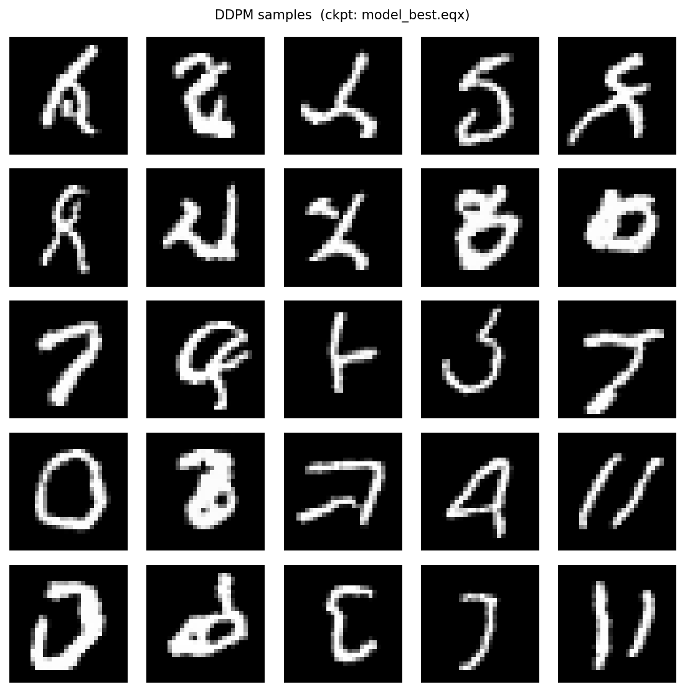
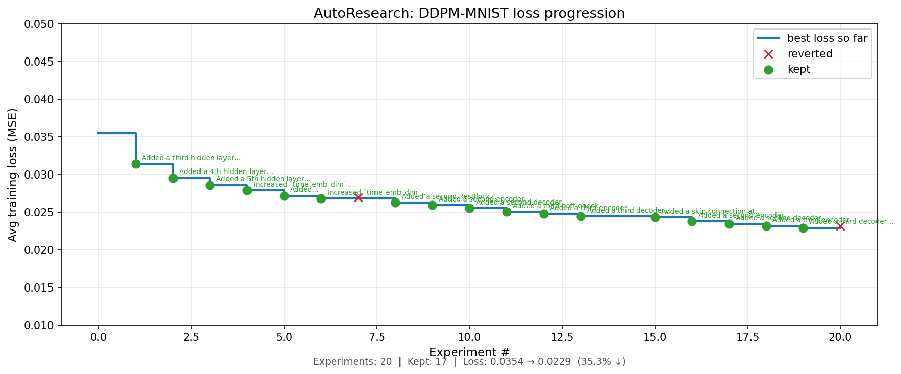

# DDPM on MNIST

A minimal implementation of [Denoising Diffusion Probabilistic Models (Ho et al., 2020)](https://arxiv.org/abs/2006.11239) trained on MNIST, built with JAX and Equinox. We found Lilian Wang's [exposition](https://lilianweng.github.io/posts/2021-07-11-diffusion-models) on this very useful to understand and implement this as well.

This repo also serves as a testbed for **autonomous ML research**. Inspired by [karpathy/autoresearch](https://github.com/karpathy/autoresearch), we include an `autorun.py` loop that hands the codebase to a Claude agent overnight: the agent reads a human-written research program (`program.md`), proposes one targeted change per experiment (architecture, noise schedule, optimizer, loss formulation), evaluates it against the current best checkpoint, and keeps or reverts the change based on whether the training loss improves. The research program is updated after every experiment to track what has been tried and reprioritize remaining directions, so the agent compounds knowledge across experiments rather than repeating itself.

## Overview

| File | Role |
|---|---|
| `ddpm_lib.py` | Shared library: noise schedule, forward diffusion (`q_sample`), `SmallUNet` model, reverse sampler |
| `train.py` | Training loop with checkpointing and TensorBoard logging |
| `sample.py` | Load a checkpoint and generate images |
| `autorun.py` | AutoResearch loop: autonomously explores improvements via Claude |
| `warm_start.py` | Checkpoint utility for partial weight transfer across architecture changes |
| `plot_experiments.py` | Plot loss progression from an autorun experiment log |
| `program.md` | Research directions used to guide the autorun agent |

The model is a small UNet with sinusoidal time embeddings, GroupNorm, and residual blocks. Training uses simple MSE noise prediction loss over T=1000 diffusion steps, trained on all 70k MNIST images (train + test split).

## Setup

```bash
conda env create -f environment.yml
conda activate jax-ddpm-mnist-env
```

Key dependencies: `jax`, `equinox`, `optax`, `tensorboardx`, `matplotlib`

## Training

```bash
python train.py --epochs 500
```

Options:
```
--epochs        Number of training epochs (default: 50)
--batch-size    Batch size (default: 128)
--lr            Learning rate (default: 2e-4)
--resume        Path to a checkpoint .eqx file to resume from
--ckpt-dir      Checkpoint directory (default: ./checkpoints)
--keep-ckpts    Number of recent checkpoints to keep (default: 3)
--tb-dir        TensorBoard log directory (default: ./runs)
```

MNIST (train + test, 70k images total) is downloaded automatically on first run.

Monitor training:
```bash
tensorboard --logdir ./runs
```

## Sampling

```bash
python sample.py
```

Options:
```
--ckpt          Path to checkpoint (default: ./checkpoints/model_best.eqx)
--n-samples     Number of images to generate (default: 25)
--out           Output image path (default: samples.png)
--seed          Random seed (default: 0)
```

## AutoResearch

`autorun.py` implements an autonomous research loop inspired by [karpathy/autoresearch](https://github.com/karpathy/autoresearch). It uses Claude to iteratively propose and test improvements to the model and training code overnight.

Each iteration:
1. Reads `program.md` for research directions
2. Calls Claude to make **one targeted change** to `train.py` or `ddpm_lib.py`
3. Evaluates the change by running a short training run, resuming from the current best checkpoint
4. Keeps the change if loss improves, reverts otherwise
5. Updates `program.md` to record what was tried and reprioritize remaining directions

Architecture changes that make a checkpoint incompatible are handled gracefully via `warm_start.py`, which transfers matching weights and randomly initialises new or resized layers.

The loop invokes the `claude` CLI as a subprocess. It picks up your Claude credentials from the environment (i.e. `ANTHROPIC_API_KEY` must be set before running).

```bash
# Quick test (1 experiment, 1 epoch per eval)
python autorun.py --eval-epochs 1 --n-experiments 1

# Overnight run with git commits and final merge to master
python autorun.py --eval-epochs 3 --n-experiments 50 --commit --merge-to master
```

Options:
```
--eval-epochs     Epochs per evaluation run (default: 3)
--n-experiments   Number of experiments to run (default: 50)
--timeout         Per-eval timeout in seconds (default: 900)
--log-file        Path to JSONL experiment log (default: experiments.jsonl)
--commit          Git-commit each kept improvement on a dedicated autorun branch
--merge-to        Merge the autorun branch into this branch at the end (e.g. master)
```

Each run operates on a dedicated `autorun/YYYYMMDD-HHMMSS` branch, keeping `master` clean. With `--commit`, every kept change becomes its own commit so the full improvement history is preserved.

## Plotting AutoResearch Results

```bash
python plot_experiments.py --log experiments.jsonl --out autorun_results.png
```

Generates a figure showing loss progression across experiments — kept changes (green) vs reverted (red), with the best-so-far staircase overlaid.

## Example Output

After 500 epochs, the model generates handwritten digit images from pure Gaussian noise via the reverse diffusion chain (before AutoResearch).



## AutoResearch Results

Loss progression across autorun experiments (generated by `plot_experiments.py`):


