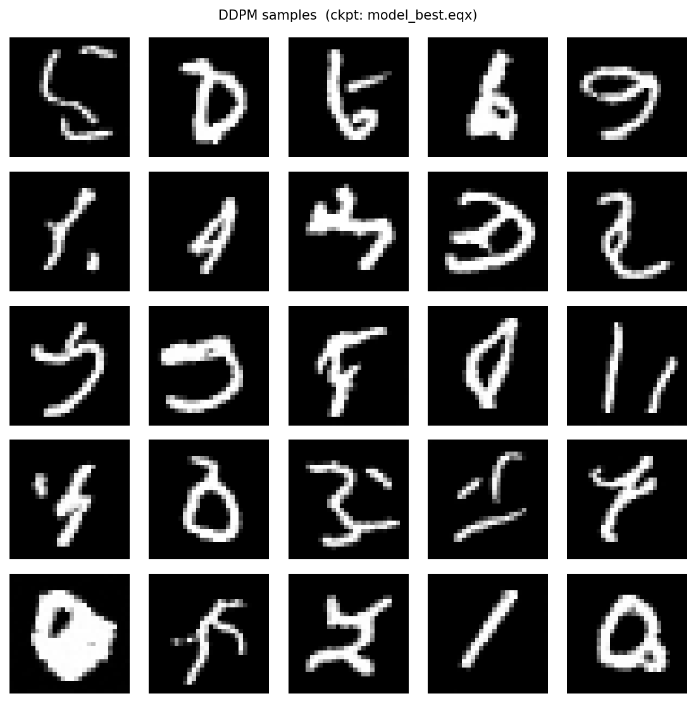

# DDPM on MNIST

A minimal implementation of [Denoising Diffusion Probabilistic Models (Ho et al., 2020)](https://arxiv.org/abs/2006.11239) trained on MNIST, built with JAX and Equinox. We found Lilian Wang's [exposition](https://lilianweng.github.io/posts/2021-07-11-diffusion-models) on this very useful to understand implement this as well.

## Overview

- **`ddpm_lib.py`** — shared library: linear noise schedule, forward diffusion (`q_sample`), `SmallUNet` model, and reverse sampler
- **`train.py`** — training loop with checkpointing and TensorBoard logging
- **`sample.py`** — load a checkpoint and generate images

The model is a small UNet with sinusoidal time embeddings, GroupNorm, and residual blocks. Training uses simple MSE noise prediction loss over T=1000 diffusion steps.

## Setup

```bash
conda env create -f environment.yml
conda activate jax-ddpm-mnist-env
```

Key dependencies: `jax`, `equinox`, `optax`, `tensorboardx`, `matplotlib`

## Training

```bash
python train.py --epochs 500
```

Options:
```
--epochs        Number of training epochs (default: 50)
--batch-size    Batch size (default: 128)
--lr            Learning rate (default: 2e-4)
--resume        Path to a checkpoint .eqx file to resume from
--ckpt-dir      Checkpoint directory (default: ./checkpoints)
--keep-ckpts    Number of recent checkpoints to keep (default: 3)
--tb-dir        TensorBoard log directory (default: ./runs)
```

MNIST is downloaded automatically on first run.

Monitor training:
```bash
tensorboard --logdir ./runs
```

## Sampling

```bash
python sample.py
```

Options:
```
--ckpt          Path to checkpoint (default: ./checkpoints/model_best.eqx)
--n-samples     Number of images to generate (default: 25)
--out           Output image path (default: samples.png)
--seed          Random seed (default: 0)
```

## Example Output

After 500 epochs, the model generates handwritten digit images from pure Gaussian noise via the reverse diffusion chain.


